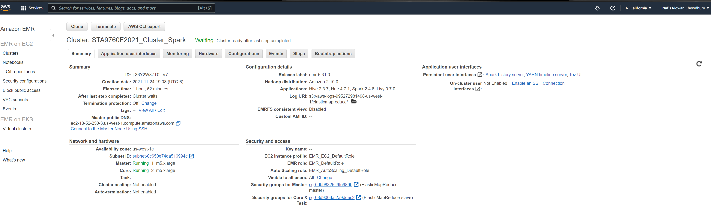
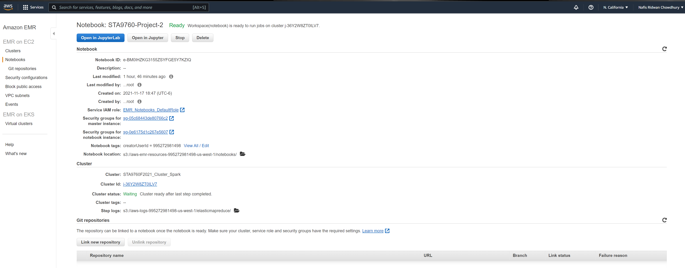

## Introduction

This is a Big Data Technology project where I will be analyzing Yelp Dataset from [Kaggle](https://www.kaggle.com/yelp-dataset/yelp-dataset) which is 11 GB in size. Different sorts of big data technologies will be used in this project which will be described in brief below.

## Big Data Technologies

The following Big Data Technologies were used for this project:

* AWS S3: To upload and store 11 GB of Yelp Data from the Local computer which was downloaded from Kaggle
* AWS EMR Cluster: To Create a Cluster which will be used to run the Jupyter Notebook
* AWS EMR Notebook: To code and analyze the dataset in the Pyspark Jupyter Notebook

## Brief Procedures

Step 1: The JSON files were downloaded from Kaggle. Then, a bucket was created in the AWS S3. These data were then uploaded in the bucket so that those can be read in the EMR Notebook.

Step 2: Next an EMR Cluster was created which will be used to run the notebook.

Step 3: Finally, a Jupyter notebook was initialized in the cluster where further analysis on the dataset was done.

## Data Analysis

The Analysis part is divided into four parts.

In **Part-1**, all necessary libraries were installed in the Jupyter notebook as well as I loaded the datasets into the notebook. In the whole dataset, there were 5 JSON files. But for this project, I used three biggest json datasets which are: business, user and reviews.

The following section (**Part-2**) was used to analyze the **Business** data. In this section, I have shown the Top Categories of business.

The **Part-3** was mostly dedicated for **Reviews** data where I wanted to analyze where the Yelp Reviews skew negative or not.

Finally in **Part-4**, i joined busines and Reviews dataset with the User dataset. Then few relevant analysis was conducted with the massive joined dataset. 

##  Amazon EMR Cluster Configuration

The folowing details were used to create the EMR cluster.

##  Notebook Configuration

The Pyspark Jupyter notebook was configured like this:

## References

 - [Kaggle](https://www.kaggle.com/yelp-dataset/yelp-dataset)

